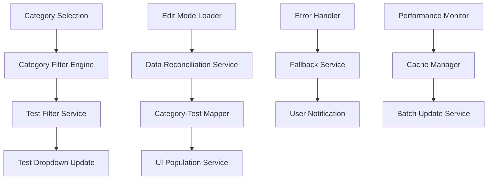
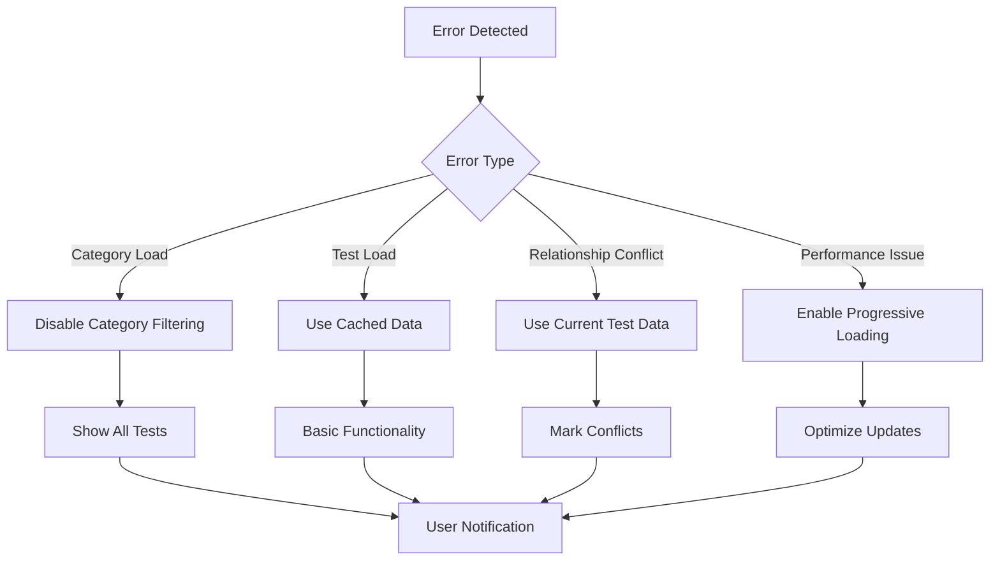

# Design Document

## Overview

This design addresses the test category filtering issues in the hospital entry system's edit modal. The solution focuses on improving the relationship between category selection and test filtering, ensuring data consistency during edit operations, and providing robust error handling. The design emphasizes maintaining backward compatibility while significantly improving user experience and data accuracy.

## Architecture

### Current System Analysis

The existing system has several architectural issues:

1. **Inconsistent Data Flow**: Category selection doesn't properly trigger test filtering
2. **Edit Mode Data Mismatch**: Edit mode uses stored entry categories instead of current test categories
3. **Missing Error Boundaries**: No graceful degradation when category/test data fails to load
4. **Performance Issues**: Inefficient DOM updates and repeated API calls

### Proposed Architecture



## Components and Interfaces

### 1. Category Filter Engine

**Purpose**: Centralized logic for handling category-based test filtering

**Key Methods**:
- `filterTestsByCategory(categoryId)`: Returns filtered test array
- `updateTestDropdownsForCategory(categoryId)`: Updates all test dropdowns
- `clearCategoryFilter()`: Resets to show all tests
- `applyCategoryFilter(categoryId)`: Applies category filter globally

**Interface**:
```javascript
class CategoryFilterEngine {
    constructor(testsData, categoriesData) {
        this.testsData = testsData;
        this.categoriesData = categoriesData;
        this.activeFilter = null;
    }
    
    filterTestsByCategory(categoryId) {
        // Returns array of tests matching category
    }
    
    updateTestDropdownsForCategory(categoryId, targetRows = null) {
        // Updates specific rows or all rows
    }
}
```

### 2. Data Reconciliation Service

**Purpose**: Ensures data consistency between stored entry data and current test/category data

**Key Methods**:
- `reconcileTestCategories(entryTests)`: Maps entry tests to current categories
- `validateTestCategoryRelationships(tests)`: Checks data integrity
- `resolveConflicts(entryData, currentData)`: Handles data mismatches

**Interface**:
```javascript
class DataReconciliationService {
    reconcileTestCategories(entryTests) {
        return entryTests.map(test => {
            const currentTest = this.findCurrentTestData(test.test_id);
            return {
                ...test,
                current_category_id: currentTest?.category_id,
                current_category_name: currentTest?.category_name,
                category_source: 'current' // or 'entry' or 'fallback'
            };
        });
    }
}
```

### 3. UI Population Service

**Purpose**: Handles efficient and consistent UI updates

**Key Methods**:
- `populateTestRow(rowData, testData)`: Populates a single test row
- `batchUpdateTestRows(rowsData)`: Updates multiple rows efficiently
- `updateCategoryDropdown(dropdown, selectedValue)`: Updates category dropdown
- `syncCategoryTestSelection(row)`: Syncs category and test selections

### 4. Error Handler and Fallback Service

**Purpose**: Provides graceful error handling and recovery

**Key Methods**:
- `handleCategoryLoadError()`: Manages category loading failures
- `handleTestLoadError()`: Manages test loading failures
- `provideFallbackData()`: Provides minimal working data
- `recoverFromError(errorType)`: Attempts error recovery

## Data Models

### Enhanced Test Data Model
```javascript
{
    id: number,
    name: string,
    category_id: number,
    category_name: string,
    main_category_id: number,
    // ... existing fields
    
    // New fields for better categorization
    category_source: 'database' | 'cache' | 'fallback',
    last_updated: timestamp
}
```

### Category Relationship Model
```javascript
{
    test_id: number,
    entry_category_id: number,      // Category from entry data
    current_category_id: number,    // Current category from test data
    resolved_category_id: number,   // Final resolved category
    conflict_detected: boolean,
    resolution_method: string
}
```

### Filter State Model
```javascript
{
    global_filter: {
        active: boolean,
        category_id: number | null,
        applied_at: timestamp
    },
    row_filters: Map<rowIndex, categoryId>,
    performance_metrics: {
        last_filter_time: number,
        cache_hit_rate: number
    }
}
```

## Error Handling

### Error Categories and Responses

1. **Category Data Loading Errors**
   - Disable category filtering
   - Show all tests in dropdowns
   - Display user-friendly message
   - Provide retry mechanism

2. **Test Data Loading Errors**
   - Use cached data if available
   - Show basic test selection without filtering
   - Log detailed error information
   - Offer manual refresh option

3. **Category-Test Relationship Conflicts**
   - Prioritize current test data over entry data
   - Mark conflicts for user review
   - Provide conflict resolution UI
   - Log conflicts for analysis

4. **Performance Degradation**
   - Implement progressive loading
   - Use debounced updates
   - Cache frequently accessed data
   - Monitor and alert on slow operations

### Fallback Strategies



## Testing Strategy

### Unit Testing
- Test category filtering logic with various data scenarios
- Test data reconciliation with conflicting data
- Test error handling with simulated failures
- Test performance with large datasets

### Integration Testing
- Test category-test filtering workflow end-to-end
- Test edit mode data population and consistency
- Test error recovery and fallback mechanisms
- Test UI responsiveness under various conditions

### User Acceptance Testing
- Test category selection and test filtering workflow
- Test edit mode accuracy and data consistency
- Test error scenarios and recovery options
- Test performance with realistic data volumes

### Performance Testing
- Measure filtering response times with large test datasets
- Test memory usage with multiple concurrent edit sessions
- Measure API call efficiency and caching effectiveness
- Test UI responsiveness during batch updates

## Implementation Phases

### Phase 1: Core Filtering Logic
- Implement CategoryFilterEngine
- Fix basic category-to-test filtering
- Add performance monitoring
- Basic error handling

### Phase 2: Edit Mode Data Consistency
- Implement DataReconciliationService
- Fix edit mode category-test relationships
- Add conflict detection and resolution
- Enhanced error handling

### Phase 3: UI/UX Improvements
- Implement UIPopulationService
- Add loading states and progress indicators
- Improve error messages and recovery options
- Performance optimizations

### Phase 4: Advanced Features
- Add caching and performance optimizations
- Implement advanced conflict resolution
- Add analytics and monitoring
- Documentation and training materials

## Performance Considerations

### Optimization Strategies
1. **Caching**: Cache category and test data with appropriate TTL
2. **Debouncing**: Debounce filter operations to prevent excessive updates
3. **Batch Updates**: Group DOM updates to minimize reflows
4. **Lazy Loading**: Load category data only when needed
5. **Memory Management**: Clean up event listeners and cached data

### Performance Targets
- Category filtering: < 200ms response time
- Edit mode loading: < 500ms for typical entries
- Memory usage: < 50MB for large datasets
- API calls: Minimize to essential requests only

## Security Considerations

### Data Validation
- Validate category IDs before filtering
- Sanitize user input in category selections
- Prevent XSS in category/test names
- Validate data integrity during reconciliation

### Access Control
- Respect existing user permissions for categories
- Maintain audit trail for category changes
- Prevent unauthorized category modifications
- Log security-relevant events

## Monitoring and Analytics

### Key Metrics
- Category filtering usage patterns
- Edit mode data conflict frequency
- Error rates and recovery success
- Performance metrics and trends

### Alerting
- High error rates in category loading
- Performance degradation alerts
- Data consistency issues
- User experience problems

This design provides a comprehensive solution to the test category filtering issues while maintaining system stability and performance.